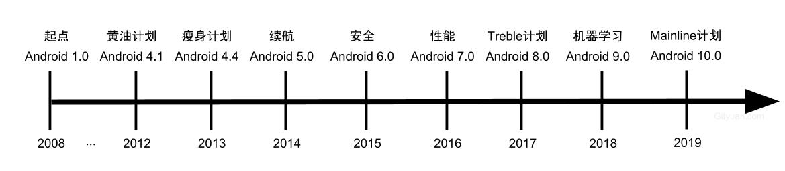

# Android系统演进

这周六（2019-4-20）我去参加了安卓巴士举办的[开发者大会](http://web.mob.com/site/h5/h5420/#/schedule)，会议上Gityuan分享了[Android技术架构演进与未来](http://gityuan.com/2019/03/20/android_future/)。

文末我会附上这次开发者大会的所有ppt。如有侵权，请告知，我会立即删除。

本篇文章回顾下Android系统演进部分。

## 系统演进
以时间线的方式回顾下Android的重要节点。

(<smal>图片来自于[Gityuan](http://gityuan.com/images/android-future/android_os_evolution.jpg)，如有侵权请告知，立马删除</smal>)

当然我们知道，2003年10月Andy Rubin创办了Android公司，2005年8月谷歌收购了Android公司，真正开始了Android的重要进程。

随着每个Android大版本的更新迭代，Android在用户体验、流畅性、续航、安全、隐私、机器学习等方面都取得了很大的进步。现在可以讲Android系统本身已经完全不虚iOS系统，但是应用质量还弱于iOS，这和iOS生态管理也息息相关。

- Android1.0到Android4.0应该是Android完善系统功能和特性的过程。
- Android4.1系统，很多人对Android的印象是Android手机非常卡，特别是用久了之后，为了让Android在流畅性有大的改进，Google开展了**黄油计划（Project Butter）**，希望Android系统能像黄油一样顺滑。核心原理是系统框架渲染层和动画统一采用垂直同步技术（VSYNC）和三重缓冲技术（Triple Buffer），可以参考Gityuan的文章。
- Android4.4，为了降低安卓系统的内存使用，Google开展了**瘦身计划（Project Svelte）**，支持`沉浸式`模式。
- Android5.0，开展了**伏特计划（Project Volta）**提升续航，采用ART虚拟机取代Dalvik虚拟机，UI方面设计了Material Design语言风格，在用户体验方面有了很大提升，现在来看很多应用的最低版本都是5.0。
- Android6.0，引入了动态权限机制，把权限主动交给了用户管理，使用了Doze模式，进一步提升续航能力。
- Android7.0，采用JIT/AOT混合编译模式。使得Android安装快、执行效率也很快。`JIT`(Just in time)即时编译，运行时编译，可以对执行次数频繁的dex代码进行编译与优化。使得Dalvik在运行应用的响应时间大大减小。`AOT`(Ahead of time)，预编译技术，在应用安装时就完成了所有编译工作。牺牲了安装时间，之后在打开应用时不需要再编译，直接使用本地机器码运行，提升了运行速度。Android7.0采用混合编译模式，统称为AOT（All of the time）全时编译，JIT编译器对ART进行代码分析，在应用运行过程优化应用性能，当设备空闲时，ART会根据JIT分析结果，对代码中常用方法进行编译。
- Android8.0，开展**Project Treble**，重构Android架构，将Android系统框架与Vendor层解耦，解决Android碎片化问题。加强对后台服务、广播、位置的控制。
- Android9.0，引入神经网络、机器学习，预测用户使用习惯，进行省电优化。强化Treble计划，改进文件系统，进一步限制私有API，强化隐私和安全。UI方面，采用新的手势导航，支持刘海屏等。
- Android10.0，开展**Project Mainline**，某些模块不允许厂商修改，只能有Google商店更新升级，强化用户隐私、系统安全和兼容性。

Gityuan在分享大会上也提到了，不管Android如何变化，万变不离其宗，Android整体架构没有变化，每一次版本提升，是对系统架构的丰富和加强。

(<small>图片来自[Gityuan](http://gityuan.com/images/android-future/android-arch.png) 如有侵权请告知，立即删除</small>)

安卓巴士大会所有PPT分享(如有侵权请告知，我会立即删除)

链接: https://pan.baidu.com/s/1gGjt2bJlSFBhvb_bMAdJ-g   
提取码: tg2v

