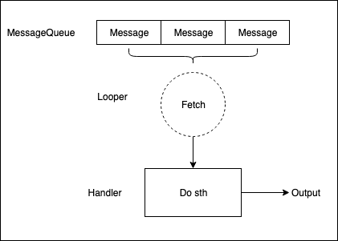
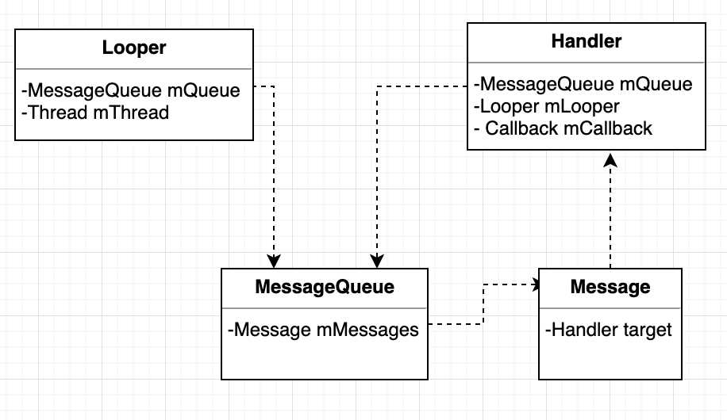

# Handler源码分析
Handler在Android多线程场景中应用广泛。

## Handler作用
Handler可以将工作线程中需要更新UI的操作信息传递到UI线程（主线程）。多个线程同时更新UI的时候，可以保证线程安全。

## 相关概念
要理解Handler的工作机制，需要了解几个类：Handler，MessageQueue，Message，Looper。

先看一张图：



简单来说，Handler发送消息Message到MessageQueue中，Looper不断获取MessageQueue中Message，然后再交由Handler来处理。

再来看一张类图：



类图中没有直观地反应Handler与Thread的关系，但可以看出：
- 每个Thread只对应一个Looper
- 每个Looper只对应一个MessageQueue
- 每个MessageQueue中有N个Message
- 每个Message最多指定一个Handler（target）来处理事件

所以，Thread和Handler是一对多的关系。

## 消息循环
从Handler的入口开始分析，看一看Handler的构造方法。
```Java
/**
    * Use the {@link Looper} for the current thread with the specified callback interface
    * and set whether the handler should be asynchronous.
    *
    * Handlers are synchronous by default unless this constructor is used to make
    * one that is strictly asynchronous.
    *
    * Asynchronous messages represent interrupts or events that do not require global ordering
    * with respect to synchronous messages.  Asynchronous messages are not subject to
    * the synchronization barriers introduced by {@link MessageQueue#enqueueSyncBarrier(long)}.
    *
    * @param callback The callback interface in which to handle messages, or null.
    * @param async If true, the handler calls {@link Message#setAsynchronous(boolean)} for
    * each {@link Message} that is sent to it or {@link Runnable} that is posted to it.
    *
    * @hide
    */
public Handler(Callback callback, boolean async) {
    if (FIND_POTENTIAL_LEAKS) {
        final Class<? extends Handler> klass = getClass();
        if ((klass.isAnonymousClass() || klass.isMemberClass() || klass.isLocalClass()) &&
                (klass.getModifiers() & Modifier.STATIC) == 0) {
            Log.w(TAG, "The following Handler class should be static or leaks might occur: " +
                klass.getCanonicalName());
        }
    }

    mLooper = Looper.myLooper();
    if (mLooper == null) {
        throw new RuntimeException(
            "Can't create handler inside thread that has not called Looper.prepare()");
    }
    mQueue = mLooper.mQueue;
    mCallback = callback;
    mAsynchronous = async;
}
```
Handler构造函数里面只是做了初始化的工作，真正开启消息循环的方法是通过Looper的prepare()和loop().
```Java
/**
    * Run the message queue in this thread. Be sure to call
    * {@link #quit()} to end the loop.
    */
public static void loop() {
    final Looper me = myLooper();
    if (me == null) {
        throw new RuntimeException("No Looper; Looper.prepare() wasn't called on this thread.");
    }
    final MessageQueue queue = me.mQueue;

    // Make sure the identity of this thread is that of the local process,
    // and keep track of what that identity token actually is.
    Binder.clearCallingIdentity();
    final long ident = Binder.clearCallingIdentity();

    for (;;) {
        Message msg = queue.next(); // might block
        if (msg == null) {
            // No message indicates that the message queue is quitting.
            return;
        }

        // This must be in a local variable, in case a UI event sets the logger
        final Printer logging = me.mLogging;
        if (logging != null) {
            logging.println(">>>>> Dispatching to " + msg.target + " " +
                    msg.callback + ": " + msg.what);
        }

        final long slowDispatchThresholdMs = me.mSlowDispatchThresholdMs;

        final long traceTag = me.mTraceTag;
        if (traceTag != 0 && Trace.isTagEnabled(traceTag)) {
            Trace.traceBegin(traceTag, msg.target.getTraceName(msg));
        }
        final long start = (slowDispatchThresholdMs == 0) ? 0 : SystemClock.uptimeMillis();
        final long end;
        try {
            msg.target.dispatchMessage(msg);
            end = (slowDispatchThresholdMs == 0) ? 0 : SystemClock.uptimeMillis();
        } finally {
            if (traceTag != 0) {
                Trace.traceEnd(traceTag);
            }
        }
        if (slowDispatchThresholdMs > 0) {
            final long time = end - start;
            if (time > slowDispatchThresholdMs) {
                Slog.w(TAG, "Dispatch took " + time + "ms on "
                        + Thread.currentThread().getName() + ", h=" +
                        msg.target + " cb=" + msg.callback + " msg=" + msg.what);
            }
        }

        if (logging != null) {
            logging.println("<<<<< Finished to " + msg.target + " " + msg.callback);
        }

        // Make sure that during the course of dispatching the
        // identity of the thread wasn't corrupted.
        final long newIdent = Binder.clearCallingIdentity();
        if (ident != newIdent) {
            Log.wtf(TAG, "Thread identity changed from 0x"
                    + Long.toHexString(ident) + " to 0x"
                    + Long.toHexString(newIdent) + " while dispatching to "
                    + msg.target.getClass().getName() + " "
                    + msg.callback + " what=" + msg.what);
        }

        msg.recycleUnchecked();
    }
}
```
loop()中有一个无限 for循环，不断地从MessageQueue中取出Message，然后通过**msg.target**.dispatchMessage(msg)来分发消息处理，其实这里的**msg.target**就是Handler，在后面源码分析中会看到。

## 发送消息
发送消息是Handler的一个作用，通过post或者send来将Message压入MessageQueue。
- post  
  post(Runnable r);  
  postAtTime(Runnable r, long uptimeMillis);

- Send  
  sendEmptyMessage(int what);
  sendMessageAtFrontOfQueue(Message msg);
  snedMessageAtTime(Message msg, long uptimeMillis);
  sendMessageDelayed(Message msg, long delayMills);

其实，post方法最终也是调用了send方法，将post中的Runnable转换成Message的callback。
```Java
public final boolean post(Runnable r) {
    return sendMessageDelayed(getPostMessage(r), 0);
}

private static Message getPostMessage(Runnable r) {
    /*
    Android系统会维护一个全局的Message池。当用户需要使用Message时，可以通过obtain直接获得，而不是自行创建。这样的设计可以避免不必要的资源浪费。
    */
    Message m = Message.obtain();
    m.callback = r;
    return m;
}
```
看一看send源码
```Java
public final boolean sendEmptyMessage(int what) {
    return sendEmptyMessageDelayed(what, 0);
}

public final boolean sendEmptyMessageDelayed(int what, long delayMillis) {
    Message msg = Message.obtain();
    msg.what = what;
    return sendMessageDelayed(msg, delayMillis);
}

public boolean sendMessageAtTime(Message msg, long uptimeMillis) {
    MessageQueue queue = mQueue;
    if (queue == null) {
        RuntimeException e = new RuntimeException(
                this + " sendMessageAtTime() called with no mQueue");
        Log.w("Looper", e.getMessage(), e);
        return false;
    }
    return enqueueMessage(queue, msg, uptimeMillis);
}

private boolean enqueueMessage(MessageQueue queue, Message msg, long uptimeMillis) {
    msg.target = this;
    if (mAsynchronous) {
        msg.setAsynchronous(true);
    }
    return queue.enqueueMessage(msg, uptimeMillis);
}
```
也就是说post或者send函数都是调用sendMessageDelayed方法，最终都会调用sendMessageAtTime方法，然后通过enqueueMessage方法将Message压入队列。这里有一行msg.target = this，将Handler赋值给msg的target。

## 消息队列
MessageQueue，名字叫队列，MessageQueue有两个重要的方法。
- 元素入队  
  enqueueMessage(Message msg, long when);
- 元素出队  
  next();

MessageQueue有一个成员变量Message mMessages, Message实际上是一个链表。

```Java
public final class Message implements Parcelable {
/*package*/ Handler target;

/*package*/ Runnable callback;

// sometimes we store linked lists of these things
/*package*/ Message next;
}
```

再看一看MessageQueue中的**enqueueMessage**方法

```Java
boolean enqueueMessage(Message msg, long when) {
    if (msg.target == null) {
        throw new IllegalArgumentException("Message must have a target.");
    }
    if (msg.isInUse()) {
        throw new IllegalStateException(msg + " This message is already in use.");
    }

    synchronized (this) {
        if (mQuitting) {
            IllegalStateException e = new IllegalStateException(
                    msg.target + " sending message to a Handler on a dead thread");
            Log.w(TAG, e.getMessage(), e);
            msg.recycle();
            return false;
        }

        msg.markInUse();
        msg.when = when;
        Message p = mMessages;
        boolean needWake;
        if (p == null || when == 0 || when < p.when) {
            // New head, wake up the event queue if blocked.
            msg.next = p;
            mMessages = msg;
            needWake = mBlocked;
        } else {
            // Inserted within the middle of the queue.  Usually we don't have to wake
            // up the event queue unless there is a barrier at the head of the queue
            // and the message is the earliest asynchronous message in the queue.
            needWake = mBlocked && p.target == null && msg.isAsynchronous();
            Message prev;
            for (;;) {
                prev = p;
                p = p.next;
                if (p == null || when < p.when) {
                    break;
                }
                if (needWake && p.isAsynchronous()) {
                    needWake = false;
                }
            }
            msg.next = p; // invariant: p == prev.next
            prev.next = msg;
        }

        // We can assume mPtr != 0 because mQuitting is false.
        if (needWake) {
            nativeWake(mPtr);
        }
    }
    return true;
}
```
从上述代码可以看出MessageQueue的中链表Message是按照when从小到大排序的，当一个新的Message要入列的话，会遍历链表，比较when直到插入到正确的位置。

再看看**next()方法**
```Java
    Message next() {

        ...

        for (;;) {
            if (nextPollTimeoutMillis != 0) {
                Binder.flushPendingCommands();
            }

            nativePollOnce(ptr, nextPollTimeoutMillis);

            synchronized (this) {
                // Try to retrieve the next message.  Return if found.
                final long now = SystemClock.uptimeMillis();
                Message prevMsg = null;
                Message msg = mMessages;
                if (msg != null && msg.target == null) {
                    // Stalled by a barrier.  Find the next asynchronous message in the queue.
                    do {
                        prevMsg = msg;
                        msg = msg.next;
                    } while (msg != null && !msg.isAsynchronous());
                }
                if (msg != null) {
                    if (now < msg.when) {
                        // Next message is not ready.  Set a timeout to wake up when it is ready.
                        nextPollTimeoutMillis = (int) Math.min(msg.when - now, Integer.MAX_VALUE);
                    } else {
                        // Got a message.
                        mBlocked = false;
                        if (prevMsg != null) {
                            prevMsg.next = msg.next;
                        } else {
                            mMessages = msg.next;
                        }
                        msg.next = null;
                        if (DEBUG) Log.v(TAG, "Returning message: " + msg);
                        msg.markInUse();
                        return msg;
                    }
                } else {
                    // No more messages.
                    nextPollTimeoutMillis = -1;
                }

                ...
        }
    }
```
这里next()方法有点类似迭代器的next()，返回第一个target不为空的异步msg。这个方法可能会阻塞。

## 消息处理
消息处理是通过Handler的dispatchMessage()方法分发。我们来看下dispatchMessage的源码。
```Java
/**
    * Callback interface you can use when instantiating a Handler to avoid
    * having to implement your own subclass of Handler.
    */
public interface Callback {
    /**
        * @param msg A {@link android.os.Message Message} object
        * @return True if no further handling is desired
        */
    public boolean handleMessage(Message msg);
}

/**
    * Subclasses must implement this to receive messages.
    */
public void handleMessage(Message msg) {
}

/**
    * Handle system messages here.
    */
public void dispatchMessage(Message msg) {
    if (msg.callback != null) {
        handleCallback(msg);
    } else {
        if (mCallback != null) {
            if (mCallback.handleMessage(msg)) {
                return;
            }
        }
        handleMessage(msg);
    }
}
```
所以，消息处理的顺序是Message.callback-Handler.callback-Handler.handleMessage。

## 总结
一句话概括：Handler发送消息Message到MessageQueue中，Looper不断获取MessageQueue中Message，然后再交由Handler来处理。